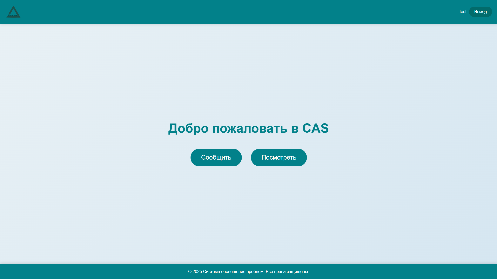
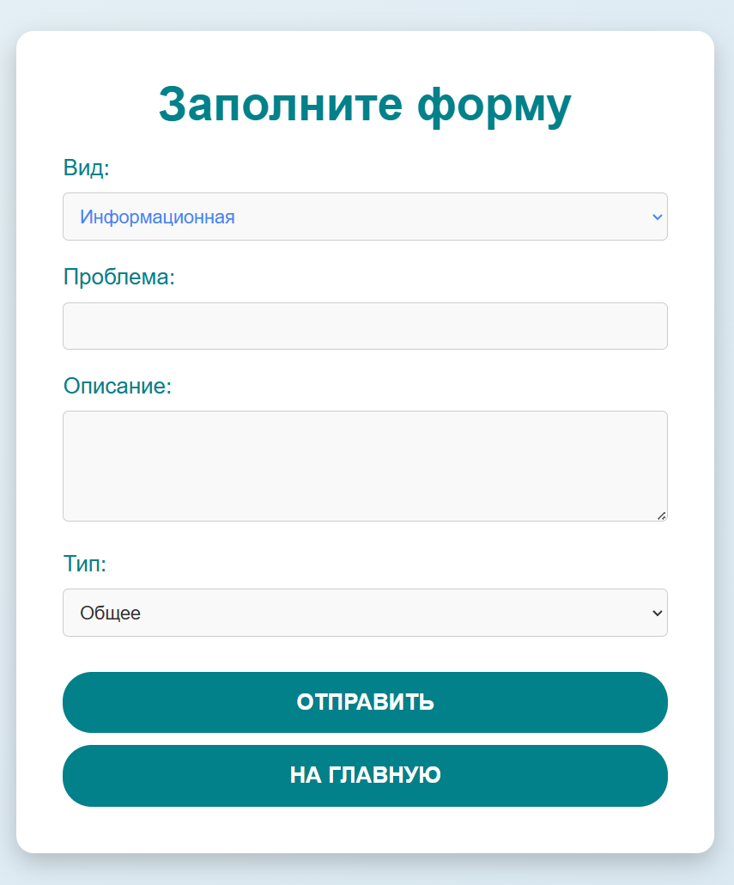
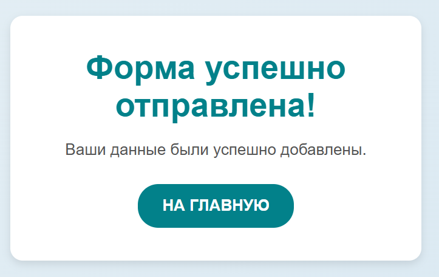
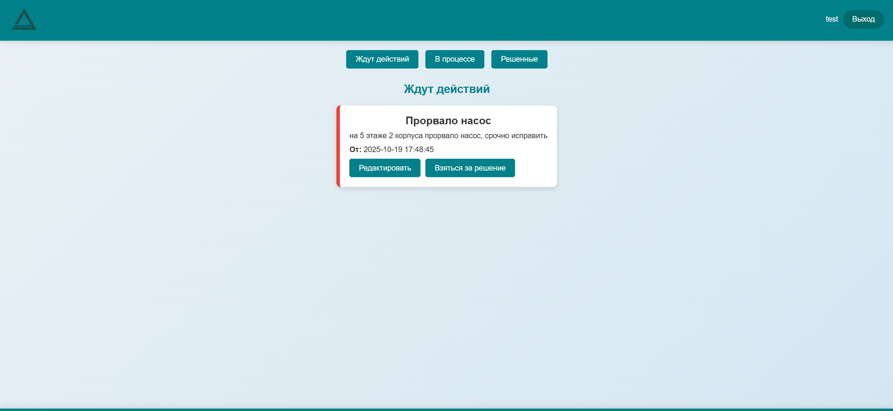

# Monitoring System

**Monitoring System** — это система оповещения о проблемах на производстве. Она позволяет пользователям:

* Регистрироваться в системе.
* Сообщать о проблемах через веб-интерфейс или Telegram-бота.
* Получать уведомления по электронной почте, через веб-интерфейс или Telegram.

## 📷 Скриншоты

<details>
<summary>Показать скриншоты</summary>

### Главная страница системы



### Форма для добавления задачи



### Окно подтверждения после заполнения формы



### Список добавленных задач



</details>

## ⚙️ Зависимости

Для запуска проекта требуется:

 **Docker**   
  - Достаточно установить [Docker Desktop](https://www.docker.com/products/docker-desktop)


## 📦 Структура проекта

* **`main.py`** — основной скрипт запуска приложения
* **`config.py`** — конфигурационные настройки приложения
* **`docker-compose.yml`** — конфигурация для запуска приложения через Docker
* **`nginx.conf`** — конфигурация веб-сервера Nginx
* **`requirements.txt`** — список зависимостей Python
* **`sender.dockerfile`** и **`web.dockerfile`** — Dockerfile для сборки образов отправителя и веб-приложения
* **`tests/load_testing`** — конфигурации для нагрузочного тестирования

## 🚀 Запуск проекта

1. Клонируйте репозиторий:

   ```bash
   git clone https://github.com/semyoonov/sibur.git
   cd sibur
   ```

2. Соберите и запустите контейнеры Docker:

   ```bash
   docker-compose up --build
   ```

3. Если развертываете локально, доступ к веб-интерфейсу будет по адресу: `http://localhost:5000`

4. Для использования Telegram-бота настройте переменные в файле `.env` (пример в `.env.example`).

## 📧 Контакты

По вопросам и предложениям обращайтесь к автору проекта: [@semyoonov](https://github.com/semyoonov)
